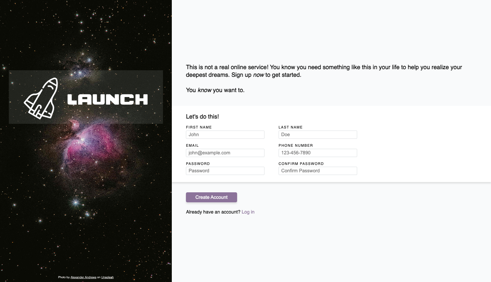
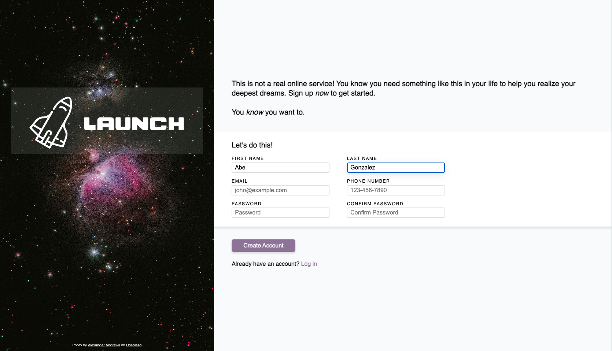

# Signup Form

Signup Form project for the Intermediate HTML and CSS Course of TOP.

Link to project spec: https://www.theodinproject.com/lessons/node-path-intermediate-html-and-css-sign-up-form

## Project showcase

### Initial form state

### Entering values into fields

### Validation on email and phone number fields

### Validation on password fields

## Credits

Photo credit: https://unsplash.com/photos/two-stars-in-the-middle-of-a-black-sky-fsH1KjbdjE8

Font credit: https://www.dafont.com/space-3.font
